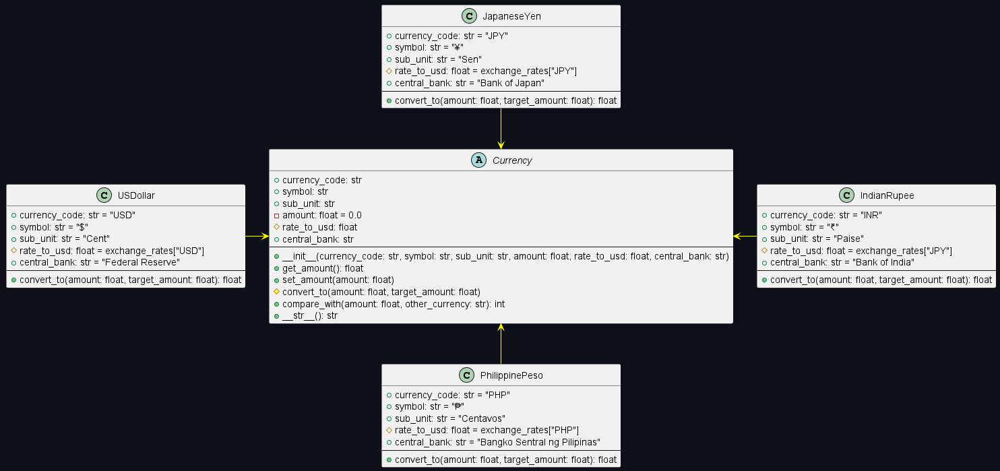
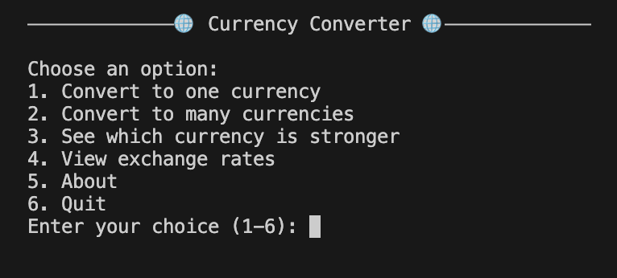

# CS 121 Laboratory Activity 3 & 4


<h3 align="center">
  <a href="#📦-features">Features</a> •
  <a href="#📈-class-diagram">Class Diagram</a> •
  <a href="#💻-code-snippet">Code Snippet</a> •
  <a href="#🧠-tech-stack">Tech Stack</a> •
  <a href="#👥-authors">Authors</a> •
</h3>

<h1 align="center">
 💵THE CONVERSION STORY💵
</h1>

### An Object-Oriented Programming Project: Class 💸Currency💸

> *Because not all heroes has every cash. We don't know how to make cents of it all but we'll try...* Your reliable, no-nonsense **currency converter** will save you from bad math exchange rates. We're making international transactions a little less tragic - one line of code at a time. 

**Project 1204: A Conversion Story** runs in the world of Python OOP, where clean structure, solid principle, and reusable logic rule the economy. Whether you're dealing in Dollars, Peso, Rupee, or Yen, this converter has your back. 


## 📦 Features

- Convert a specific amount from one currency to another
- Convert a single currency to multiple other currencies
- Compare the relative strength of two currencies
- Display current hardcoded exchange rates
- Clean command-line UI with menus
- Currency metadata including symbols, subunits, and       central banks

## 📈Class Diagram
This diagram is our basis of what object-oriented programming project we would like to create. 



This project consists of an abstract base class `Currency` that defines a standard interface for all currencies - the parent class. It is extended by four subclasses namely: `PhilippinePeso`, `JapaneseYen`, `USDollar`, and `IndianRupee`. Each currency class comes with the following properties inherited from `Currency`:

- `currency_code`: code representation (ex. "PHP", "JPY", "USD", "INR")
- `symbol`: currency symbol (ex. "₱", "¥", "$", "₹")
- `sub_unit`: fractional unit (ex. "centavo", "sen")
- `amount`: a private property that signifies the value of each currency
- `rate_to_usd`: the exchange rate relative to 1 USD
- `central_bank`: the central bank of the country of each currency

And also the methods:

- `convert_to(amount, target_currency)`: converts the current amount into a specified target currency using USDollar as a base.

- `compare_with(amount, other_currency)`: compares which in two different currencies is stronger using USDollar as basis currency.
Conversions work by converting first to USD, then from USD to the target currency.


## 💻 Code Snippet
```python
#Parent Class
class Currency(ABC):
    def __init__(self, currency_code, symbol, sub_unit, rate_to_usd, central_bank):
        self.currency_code = currency_code
        self.symbol = symbol
        self.sub_unit = sub_unit
        self.__amount = 0.0
        self._rate_to_usd = rate_to_usd
        self.central_bank = central_bank

#Sub Classes
class PhilippinePeso(Currency):
    def __init__(self):
        self.currency_code = "PHP"
        self.symbol = "₱"
        self.sub_unit = "Centavos"
        self._rate_to_usd = exchange_rates['PHP']
        self.central_bank = "Bangko Sentral ng Pilipinas"

class JapaneseYen(Currency):
    def __init__(self):
        self.currency_code = "JPY"
        self.symbol = "¥"
        self.sub_unit = "Sen"
        self._rate_to_usd = exchange_rates['JPY']
        self.central_bank = "Bank of Japan"

class USDollar(Currency):
    def __init__(self):
        self.currency_code = "USD"
        self.symbol = "$"
        self.sub_unit = "Cent"
        self._rate_to_usd = exchange_rates['USD']
        self.central_bank = "Federal Reserve"

class IndianRupee(Currency):
    def __init__(self):
        self.currency_code = "INR"
        self.symbol = "₹"
        self.sub_unit = "Paise"
        self._rate_to_usd = exchange_rates['INR']
        self.central_bank = "Bank of India"
```
## 🧠 Tech Stack

- `Python` for programming language
- `abc` for abstract base classes
- `os` for cross-platform terminal clearing

## 🚀 Usage
This project is easy to navigate. You won't sweat any bit... Follow the instructions!!
1. Install Python
2. Run the program in your terminal or command prompt.
3. Follow the prompts in the terminal. There, you'll be able to:
     - Convert an amount from one currency to another.
     - Convert an amount to multiple currencies at once.
     - Compare which currency is stronger
     - View exchange rates.
     - Read about us - the developer.
  
       
   
  
**🗒️📌Notes** 
- This program only supports PHP, JPY, USD, and INR.
- We use predefined exchange rates.

## 🌸 Acknowledgement

We would like to express our heartfelt gratitude to those who helped bring this project to life. 

First and foremost, a sincere thank you to our instructor, Ms. Fatima Marie P. Agdon, MSCS, whose thoughtful guidance and invaluable insights were essential in shaping this work. Your support has been truly appreciated.

We’d also like to thank our amazing teammates for their hard work, and dedication throughout this project. It’s been a great experience working together, and we couldn’t have done it without each other.

This project would not have been possible without all of you.

— *The Team* ✨


## 👥 Authors  
### **Team 4** - *The Collaborators*

| Members                         | Github Profile                                            |
| ------------------------------- | --------------------------------------------------------- |
| **Baes, Gian Louie D.**         | [@HaiseSasaki23](https://github.com/HaiseSasaki23)         |
| **Limboc, Nikki C.**            | [@nikkibuttowsk](https://github.com/nikkibuttowsk)         |
| **Mendoza, Lance Kert O.**      | [@sleepingPotato17](https://github.com/sleepingPotato17)   |
| **Pura, Fatima A.**             | [@st-f4tima](https://github.com/st-f4tima)                 |

